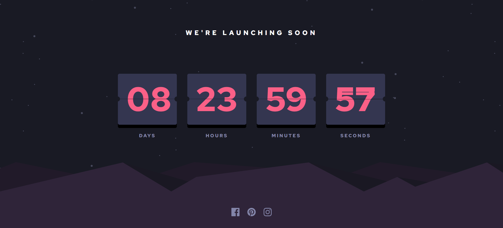
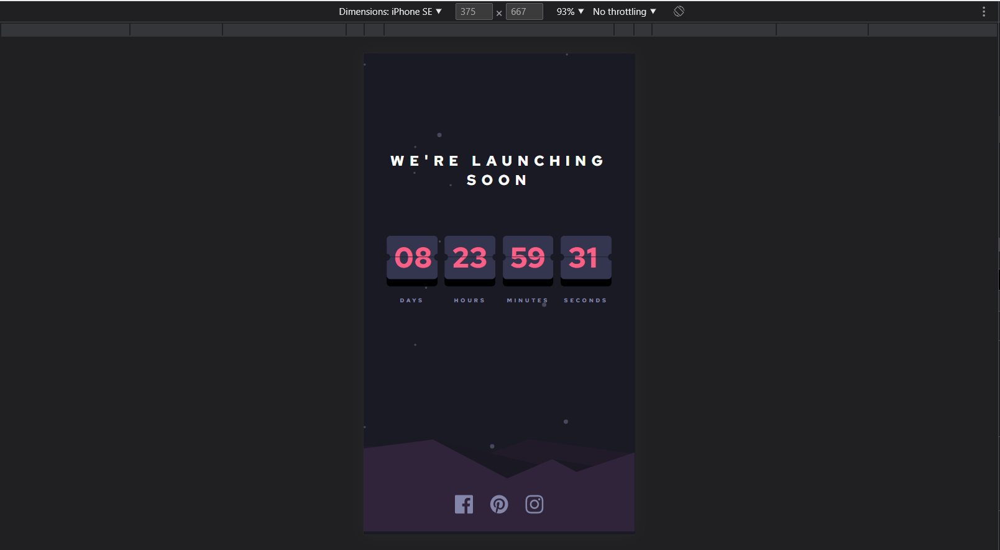
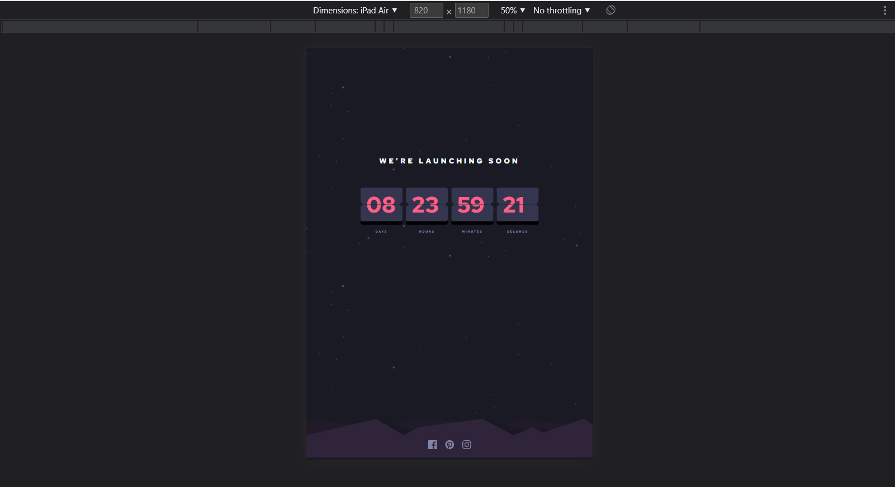

<div align="center">
  <h1>Frontend Mentor - Launch countdown timer solution</h1>
  <a href="https://flip-countdown-timer-fm.vercel.app/" target="_blank"><strong>➥ Live Demo</strong></a>
</div>
<br/>

This is a solution to the [Launch countdown timer challenge on Frontend Mentor](https://www.frontendmentor.io/challenges/launch-countdown-timer-N0XkGfyz-). Frontend Mentor challenges help you improve your coding skills by building realistic projects. 

## Table of contents

- [Overview](#overview)
  - [The challenge](#the-challenge)
  - [Screenshot](#screenshot)
  - [Links](#links)
- [My process](#my-process)
  - [Built with](#built-with)
  - [What I learned](#what-i-learned)
- [Author](#author)
- [Let's Connect](#letsconnect)


## Overview

### The challenge

Users should be able to:

- See hover states for all interactive elements on the page
- See a live countdown timer that ticks down every second (start the count at 14 days)
- **Bonus**: When a number changes, make the card flip from the middle

### Screenshot








### Links

- Solution URL: [Click Here](https://github.com/sudhanshu287/flipCountdownTimer-fm)
- Live Site URL: [Live Demo](https://flip-countdown-timer-fm.vercel.app/)

## My process

### Built with

- Semantic HTML5 markup
- CSS custom properties
- Flexbox
- CSS Grid
- Mobile-first workflow


### What I learned

```css
.top-flip {
  transform-origin: bottom;
  animation: flip-top 0.5s ease-in forwards;
  transform: rotateX(0deg);
}
.bottom-flip {
  transform-origin: top;
  animation: flip-bottom 0.5s ease-out 0.5s;
  transform: rotateX(90deg);
}

@keyframes flip-top {
  to {
    transform: rotateX(90deg);
  }
}
@keyframes flip-bottom {
  100% {
    transform: rotateX(0deg);
  }
}
```
```js
time = String(time).padStart(2, "0");
```


## Author

- Website - [Sudhanshu Patel](https://sudhanshupatel.vercel.app)
- Frontend Mentor - [@Sudhanshu287](https://www.frontendmentor.io/profile/sudhanshu287)
- Linkedin - [@Sudhanshu287](https://www.linkedin.com/in/sudhanshu287)


## **Let's Connect 👋**

<div align=center id="lets-connect">

  <a href="https://sudhanshupatel.vercel.app/" target="_blank">
    
  </a>&nbsp;&nbsp;&nbsp;

  <a href="https://linkedin.com/in/sudhanshu287" target="_blank">
    
  </a>&nbsp;&nbsp;&nbsp;

  <a href="https://www.frontendmentor.io/profile/sudhanshu287" target="_blank">
    
  </a> &nbsp;&nbsp;&nbsp;

  <a href="https://www.github.com/sudhanshu287/" target="_blank">
    
  </a>

</div>